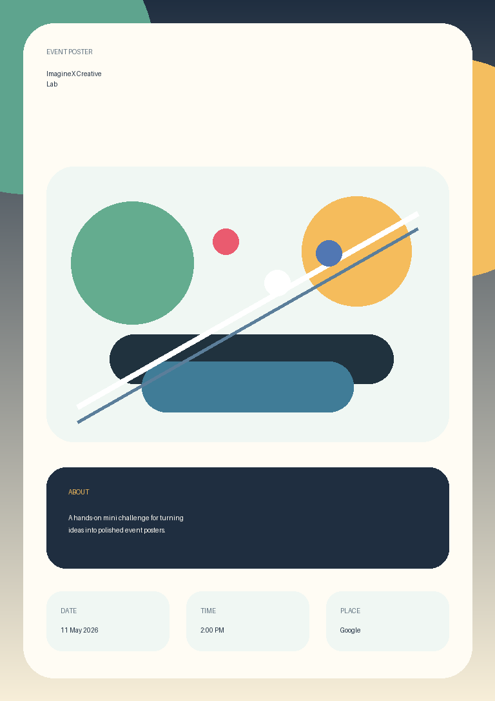

# Google Workshop - ImagineX Mini Challenge

This repository contains my workshop mini challenge code for building an event
poster creator with Python. The project uses `Pillow` to generate a polished
custom poster from event details and an optional image.

I also added a lightweight web version so the project can be opened as a live
poster creator in the browser and deployed on Vercel.

## Workshop Goal

The goal of this workshop was to practice using Python to create a small,
interactive visual application. Instead of only writing text output, the code
produces an actual event-style poster image that can be saved and reused.

## What I Worked On

In this mini challenge, I updated and fixed the notebook so it can run in both
Google Colab and a normal local Python environment.

The original mini challenge generated a basic poster. I optimized it into a
more complete event poster tool.

The main tasks included:

- Building a higher-resolution poster canvas with modern layout and colors.
- Adding structured event inputs: title, date, time, place, and short
  description.
- Supporting an optional custom image for the poster artwork.
- Drawing a default abstract illustration when no image is provided.
- Adding text wrapping so longer titles and descriptions fit better.
- Saving the final poster as a PNG image.
- Fixing Colab-only dependencies so the notebook also works locally.
- Cleaning old notebook output to make the file easier to read and maintain.

## Code I Added

I added a reusable `poster_creator.py` module with:

- `EventDetails`, a small data class for storing event information.
- `create_event_poster()`, the main function that creates the final poster.
- Helper functions for loading fonts, wrapping text, fitting images, drawing
  gradients, and placing custom artwork.

I also added:

- `tests/test_poster_creator.py` to verify the poster generator behavior.
- `requirements.txt` to document the Python dependency.
- `.gitignore` to avoid committing generated files and notebook cache folders.
- `examples/sample_poster.png` as a sample output image.

## Result

The final notebook creates a poster image called `your_poster.png`.

Users can enter:

- Event title
- Date
- Time
- Place
- Short description
- Optional image

The tool will:

- Generate a 768 x 1086 poster.
- Save the final result as a PNG file.

An example output is available at `examples/sample_poster.png`.



## Web Version

Live demo: https://imaginex-poster-creator.vercel.app

The browser version is a small static web app built with HTML, CSS, and
JavaScript. It includes:

- Live poster preview.
- Event detail inputs.
- Visual presets and accent colors.
- Optional image upload.
- PNG download from the canvas preview.

Open `index.html` locally, or deploy this repository to Vercel to share the
tool as a live website.

The design direction and Stitch prompt are documented in `design.md`.

## How To Run

Open `Mini_Challenge.ipynb` in Google Colab or Jupyter Notebook, then run the
main code cell.

Required Python package:

```bash
pip install -r requirements.txt
```

If running in Google Colab, the upload option uses Colab's file upload widget.
If running locally, the upload option asks for a local image path instead.

## How To Test

Run the unit tests with:

```bash
python -m unittest discover -s tests
```
